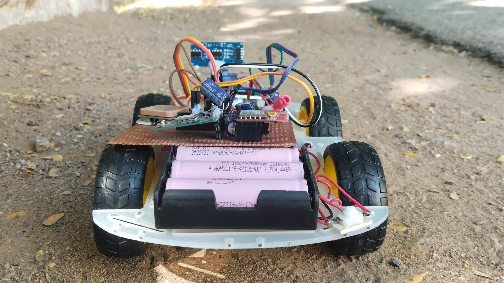
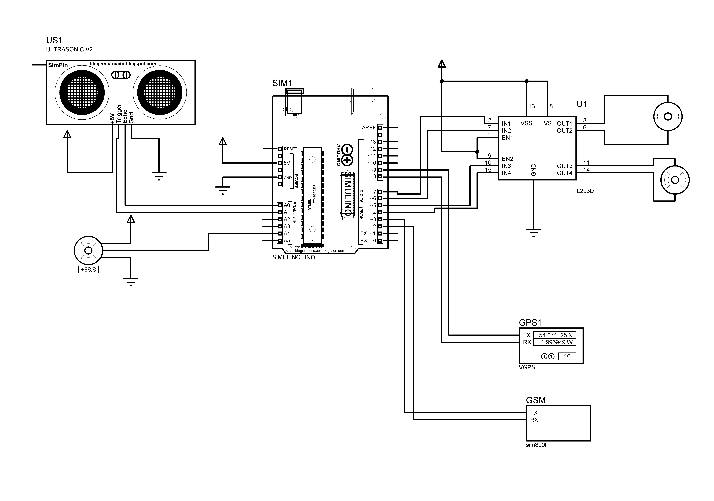

# Smart Vehcile System - Accident Avoidance and Detection Robot

The project is design to build an Accident avoidance robotic vehicle using ultrasonic sensors for its movement. Microcontroller (ATmega328) is used to achieve the desired operation. The project proposes robotic vehicle that has an intelligence built in it such that it directs itself whenever an obstacle comes in its path. 
An ultrasonic sensor is used to detect any obstacle ahead of it and sends a command to the micro-controller. Depending on the input signal received, the micro-controller redirects the robot to move in an alternate direction by actuating the motors which are interfaced to it through a motor driver. 
The robot is built on the  Arduino IDE for data processing and its software counterpart helped to communicate with the robot to send parameters for guiding movement. 
The robot is fully autonomous and after the initial loading of the code, it requires no user intervention during its operation.

## Hardware Requirements:
Arduino Uno Micro Controller, Ultrasonic Sensor  HC – SR04, GSM Module  SIM800L, GPS   Neo – 6M-0-001, SG90 Micro Servo motor, DC Motors 12v, L293D Motor Driver, Lithium Ion Batteries 3.7V, Button, Jumper Wires, Capactiors, Single Sided PCB, Robot Chassis 

## Software Requirements:
Arduino IDE with installed Libraries
Libraries : ServoTimer2, SoftwareSerial, AltSoftSerial, TinyGPS++

## Working Principle
For Accident Avoidence we used Ultrasonic Sensor  HC – SR04.
We used servo motor to rotate the ultrasonic sensor.
For Accident Detection we used GSM SIM 800L Module and GPS Neo 6M-0-001 for sending gps location SMS .

## Results
The result is obtained for Accident avoidance robot using Arduino, if the robot moves forward if any obstacle detect it check for other directions and moves where there is no obstacles it moves in forward direction, to sense the obstacle ultrasonic sensor is used. 
If the robot met with any accident a SMS will be sent to a registered mobile number , and this message contains the GPS coordinates of the accident location.

# Accident Avoidance Robot
### Back View

### Side View

### Schematic Diagram 

 ### Need for Accident Avoidance and Detection Robots
The need for developing accident avoidance and detection robots stems from the desire to reduce human error, enhance safety, provide quick and accurate responses to emergencies, and minimize the economic and social impact of accidents. These technologies are not just about preventing accidents—they are integral to advancing safety standards in various industries, improving efficiency, and creating more resilient systems for both everyday life and emergency scenarios.